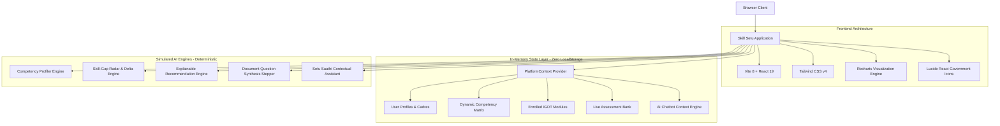

# 🇮🇳 Skill Setu (कौशल सेतु)
## AI-Enabled Skill Intelligence & Learning Platform for MoSPI / NSSTA
### Smart India Hackathon 2026 — Problem Statement ID: SIH26101

---

## 📌 Executive Summary

**Skill Setu** (कौशल सेतु) is an enterprise-grade, AI-enabled competency intelligence and adaptive learning platform engineered specifically for the **Ministry of Statistics and Programme Implementation (MoSPI)** and the **National Statistical Systems Training Academy (NSSTA)**, Government of India.

Designed in full compliance with the **Framework for Roles, Activities and Competencies (FRAC)** under **Mission Karmayogi**, Skill Setu bridges the critical gap between national statistical mandates and civil service workforce capabilities. It provides automated competency profiling, diagnostic skill-gap visualization against promotional benchmarks, transparent explainable learning recommendations mapped to iGOT Karmayogi, and an in-situ AI assessment generator that turns ministry manuals into accredited psychometric examinations.

---

## 🏛️ Ministry & Institutional Context

| Entity | Role in Statistical System | Key Responsibilities |
| :--- | :--- | :--- |
| **MoSPI** | Apex Ministry | Formulation of official statistical policy, national accounts, macroeconomic indices (CPI, IIP), and census oversight. |
| **NSSTA** | Central Training Academy | Located in Greater Noida; responsible for foundational and in-service capacity building of the Indian Statistical Service (ISS) and Subordinate Statistical Service (SSS). |
| **SDRD** | Survey Design & Research Division | Survey methodology, multi-stage sampling frames, questionnaire formulation (Kolkata). |
| **NAD** | National Accounts Division | Compilation of Gross Value Added (GVA), GDP, Supply-Use Tables, and capital formation (New Delhi). |
| **PSD** | Price Statistics Division | Monthly compilation of Consumer Price Index (CPI Rural/Urban) across 1,181 villages and 1,114 urban markets. |
| **ESD** | Economic Statistics Division | Index of Industrial Production (IIP) and Annual Survey of Industries (ASI). |
| **DQAD** | Data Quality Assurance Division | Automated validation scripts, scrutiny of enterprise returns, and sampling error control (Kolkata). |
| **FOD** | Field Operations Division | Nationwide network of regional field offices conducting primary CAPI-based household and enterprise surveys. |

---

## 🎯 Smart India Hackathon 2026 (PS ID: SIH26101) Problem Alignment

The Ministry of Statistics and Programme Implementation posed the challenge of modernizing civil service learning:
1. **Challenge 1: Opaque Competency Mapping** — Officials across cadres (ISS, SSS, field staff) lack transparent visibility into required competencies for higher-level postings.
2. **Challenge 2: Generic, Non-Explainable Recommendations** — LMS platforms recommend courses based on generic keywords rather than calculated competency deficits.
3. **Challenge 3: High Authoring Overhead for Assessments** — NSSTA faculty spend weeks manually drafting examination items from 200+ page statistical survey manuals.
4. **Challenge 4: Disconnected Learning Records** — Training hours on iGOT Karmayogi often do not translate dynamically into verified competency level upgrades.

**Skill Setu solves all four challenges through an integrated, deterministic AI intelligence engine.**

---

## 🎨 Visual Identity & GIGW Compliance Standards

Skill Setu intentionally rejects generic SaaS startup design trends in favor of an **authentic, authoritative Indian Government Portal** look and feel:

- **Official Color Palette**:
  - **Primary Navy**: `#0B3D91` (Official Government of India Blue)
  - **Deep Gov Navy**: `#07265D` (Header utility & table header backgrounds)
  - **Saffron Accent**: `#FF9933` (Tricolor high-contrast accent & CTA badges)
  - **Chakra Blue**: `#000080` (Ashoka Chakra 24-spoke motif)
  - **India Green**: `#138808` (Tricolor lower ribbon & success indicators)
  - **Background Neutral**: `#F4F6F9` (Official light administrative background)
- **National Emblem of India**:
  - High-precision SVG Lion Capital of Ashoka with the national motto **"सत्यमेव जयते"** (*Truth Alone Triumphs*) in formal Devanagari script.
- **Tricolor Ribbon Bar**:
  - Continuous Saffron, White, and Green ribbon strip with a central 24-spoke Ashoka Chakra symbol positioned beneath the primary header.
- **Typography**:
  - Formal Serif Headings (`Georgia`, `Merriweather`) paired with ultra-clean, legible sans-serif body typography (`Noto Sans`, system UI).
- **Accessibility & GIGW 3.0 Compliance**:
  - **"Skip to Main Content"** direct keyboard anchor.
  - **Font Size Multipliers**: Instant toggle between `A-` (14px), `A` (16px), and `A+` (18px).
  - **High Contrast Mode**: Instant inverted dark/high-visibility yellow contrast theme for visually impaired users.
  - **Bilingual Interface**: Quick toggle between English and हिन्दी (Devanagari).
- **Tabular Data Presentation**:
  - Bordered data grids, crisp contrast ratios, formal status badges, and zero playful/neon emojis.

---

## ⚙️ Architecture & Technical Stack



### Technology Specifications

| Layer | Technology | Rationale |
| :--- | :--- | :--- |
| **Runtime / Build** | **Vite 8.2 + Node 24** | Sub-second HMR, instant startup, production bundle in under 550ms. |
| **UI Library** | **React 19** | Component modularity, functional hooks, concurrent rendering. |
| **Styling Engine** | **Tailwind CSS v4** | Custom color variables, official government spacing tokens, zero runtime CSS overhead. |
| **Charts / Visualizations** | **Recharts 3.10** | SVG-rendered Radar Charts, Grouped Bar Charts, Donut charts, and Linear Trend graphs. |
| **State Persistence** | **In-Memory React Context** | **Strictly NO `localStorage` or `sessionStorage`** per hackathon guidelines. State survives active navigation and resets cleanly upon refresh. |
| **Iconography** | **Lucide React** | Clean, accessible vector icons for government interfaces. |

---

## 🧩 Core Interactive Modules Breakdown

### 1. Mock SSO & Role Selector
- Accessible from the top utility navigation bar.
- Instant role switching between:
  - **Learner**: Official statistical officer view (JSO, SSO, Deputy Director, Investigator).
  - **Trainer**: NSSTA faculty view with authoring studio and item review tools.
  - **Admin**: MoSPI leadership view with org-wide macro analytics.
- **Active Officer Persona Switcher**: Real-time dropdown to test different official profiles (e.g. Aadeesh Sharma - JSO, Dr. Priyadarshini Rao - SSO, Rajesh Kumar Meena - Deputy Director, Vikramaditya Sengupta - Director NSSTA).

### 2. Learner Dashboard
- **Official Welcome Banner**: Displays officer name, Karmayogi ID (KY-MOSPI-2024), cadre, division, posting location, and qualification.
- **Competency Heatmap Matrix**: An interactive grid displaying 18 competencies across Statistical, Technical, Digital Governance, and Behavioural domains. Color-coded by Level 1 (Novice) through Level 5 (Expert) with benchmark target overlays.
- **Priority Skill Gap Cards**: Top critical deficits with progress bars and direct link to bridge them.
- **Sequenced Learning Roadmap**: Step-by-step curriculum progression showing enrolled, in-progress, and completed modules.
- **Live KPI Counters**: Learning hours clocked, enrolled modules, Karmayogi credits earned, and certified tests passed.

### 3. Competency Profiling Engine
- Official service record form: Designation, Cadre (ISS, SSS, Non-Cadre, IT), Division, Academic & Technical Qualifications, Years in Service, and Specialized Survey Experience.
- **"Generate AI Competency Profile"**: Simulates a 4-stage rule engine with an evaluation log that recalculates baseline proficiency scores based on official parameters.

### 4. Skill-Gap Analysis Engine
- **Target Role Selector**: Compare current proficiency against 5 promotional benchmarks:
  - *Senior Statistical Officer (SSO)*
  - *Assistant Director (ISS Group A)*
  - *Deputy Director (National Accounts Division)*
  - *Lead Data Scientist (Center of Excellence in AI)*
  - *GIS & Spatial Analytics Lead (SDRD)*
- **Dual Recharts Visualizations**:
  - **Radar Chart Overlay**: 8-axis spider chart comparing current verified score against target requirement.
  - **Grouped Bar Chart**: Side-by-side level bars indicating exact deficit margins.
- **Detailed Gap Matrix Table**: Complete listing of codes, competencies, current level, required level, delta (-1, -2), and urgency badge (*Critical Deficit*, *Moderate Gap*, *Satisfied*).

### 5. Explainable AI Recommendation Engine
- Deterministic ranking algorithm prioritizing courses that close the user's highest deficits.
- **Transparent Explainability Card**: Shows explicit reasoning for every recommended course:
  > *"High Priority: Your current verified level in Survey Design & Sampling is Level 2, while Senior Statistical Officer mandates Level 3 (Deficit: -1). Completing this accredited course bridges this critical gap."*
- **1-Click Enroll**: Instantly registers the course on iGOT Karmayogi, adds it to the Active Learning Roadmap, and displays an official toast.

### 6. iGOT Course Catalogue
- Searchable, filterable catalogue of 18 accredited modules.
- Filters: Competency Category (Statistical, Technical, Digital Governance, Behavioural) and Level (Beginner, Intermediate, Advanced).
- Displays course duration, provider (NSSTA, ISI Kolkata, RBI Academy, NIC, IIT Delhi), rating, enrolled learners, and syllabus outline.

### 7. AI Intelligent Assessment Engine (Trainer Studio)
- **Simulated Document Ingestion**: Upload ministry manuals or circulars (e.g. `MoSPI_National_Accounts_Manual_2025.pdf`).
- **5-Stage Animated Pipeline Stepper**:
  1. *Text & Schema Extraction*
  2. *Semantic Segmentation*
  3. *MCQ Item Generation*
  4. *Psychometric Validation*
  5. *Trainer Review & Publishing*
- **Trainer Review Desk**: NSSTA faculty can preview synthesized MCQs, inline edit question stems, approve or reject individual items, and publish directly to the live examination bank.

### 8. Interactive Quiz Taking & Verified Competency Upgrade
- Clean, focused examination interface with a live countdown timer and question navigation grid.
- Instant grading with passing benchmark verification.
- **Detailed Solutions**: Explanations with official MoSPI citations for every question.
- **Animated Competency Level Upgrade Celebration**: Passing the test triggers an animated modal displaying the jump from Level N to Level N+1, awarding **+150 iGOT Karmayogi Credits** to the officer's permanent record!

### 9. Setu Saathi (कौशल साथी) AI Chat Assistant
- Floating bottom-right chat widget with state-aware intelligence.
- Canned questions and smart matching for:
  - *"Why was this course recommended to me?"*
  - *"What are my critical skill gaps for promotion to SSO?"*
  - *"Explain my last quiz mistake"*
  - *"How is Jevons Formula used in CPI compilation?"*
  - *"What is the DPDP Act 2023 statistical exemption?"*

### 10. Admin & Leadership Analytics Dashboard
- **Ministry Competency Distribution**: Donut chart illustrating the proportion of Novice, Beginner, Intermediate, Advanced, and Expert officers.
- **Emerging Skill Demand Trajectory**: Line chart projecting workforce demand for Python, AI/ML, DPDP Privacy, and Cloud APIs through 2027.
- **Department Heatmap Matrix**: Division-level proficiency indices across FOD, SDRD, NAD, ESD, DQAD, and NSSTA.
- **Cadre Breakdown**: Comparative metrics for SSS, ISS, Non-Cadre, and Contractual IT staff.

### 11. Executive Reports & Audit Desk
- Gazette-formatted training audit report suitable for Parliamentary Standing Committee reviews.
- Filters by audit quarter and cadre.
- Simulated **"Export Official PDF"** and **"Export Excel"** download actions with feedback toasts.

---

## 📊 MoSPI Competency Framework & Taxonomy

Skill Setu organizes official capabilities into 4 distinct domains aligned with National Statistical Commission (NSC) standards:

```
Competency Domains
├── 1. Statistical Domain
│   ├── STAT-01: Survey Design & Sampling (Stratification, Multi-stage, GREG)
│   ├── STAT-02: National Accounts & GDP (SNA 2008/2025, GVA, FISIM)
│   ├── STAT-03: Price Statistics (CPI / WPI, Jevons Index, Hedonics)
│   ├── STAT-04: Labour & Employment Statistics (PLFS, UPSS, CWS)
│   ├── STAT-05: Index of Industrial Production (IIP, Use-based, ASI)
│   └── STAT-06: SDG Indicators & Monitoring (National Indicator Framework)
├── 2. Technical Domain
│   ├── TECH-01: Python for Official Statistics (Pandas, Chunking, Automation)
│   ├── TECH-02: Advanced R & R-Shiny (package:survey, Quarto, Dashboards)
│   ├── TECH-03: SQL & Relational Databases (PostgreSQL, Window Functions)
│   ├── TECH-04: GIS & Spatial Mapping (QGIS, Digital Enumeration Blocks)
│   ├── TECH-05: AI & Machine Learning (NLP for NIC/NCO Auto-coding, Nowcasting)
│   └── TECH-06: Cloud Infrastructure & Open Data APIs (MeghRaj, data.gov.in)
├── 3. Digital Governance Domain
│   ├── GOV-01: Data Privacy & DPDP Act 2023 (Exemptions, SDC, K-Anonymity)
│   ├── GOV-02: Cyber Security in Government Systems (CERT-In, CAPI Tablets)
│   └── GOV-03: India Digital Public Infrastructure (India Stack, PM GatiShakti)
└── 4. Behavioural Domain
    ├── BEH-01: Public Leadership & Ethics (UN Fundamental Principles)
    ├── BEH-02: Stakeholder Communication (Parliamentary Questions, Press Notes)
    └── BEH-03: Field Survey Project Management (GFR 2017, GeM, FOD Logistics)
```

### Proficiency Level Definitions (1 - 5)

| Level | Designation | Characteristic Capabilities |
| :---: | :--- | :--- |
| **L1** | **Novice** | Understands foundational concepts, elementary definitions, and basic civil service rules. |
| **L2** | **Beginner** | Can perform routine primary data collection, single-stage frame construction, and preliminary validation checks. |
| **L3** | **Intermediate** | Independently executes multi-stage sampling designs, compiles sectoral GVA, writes SQL queries, and analyzes unit-level microdata. |
| **L4** | **Advanced** | Calibrates survey weights, formulates Supply-Use Tables, builds automated Python pipelines, and leads regional field operations. |
| **L5** | **Expert** | National authority advising the National Statistical Commission (NSC), UNSD, and ILO on statistical methodology revisions. |

---

## 🚀 Setup & Local Execution Guide

### Prerequisites
- **Node.js**: Version 18.0 or newer (tested on Node v24.19.0)
- **NPM**: Version 9.0 or newer (tested on npm 11.17.0)
- Operating System: Windows 10/11, macOS, or Linux

### Installation Steps

1. **Navigate to the Project Directory**:
   ```bash
   cd "C:\Users\Aadeesh Jain\.gemini\antigravity\scratch\skill-setu"
   ```

2. **Install Dependencies**:
   ```bash
   npm install
   ```

3. **Run the Development Server**:
   ```bash
   npm run dev
   ```
   The application will boot at: `http://localhost:5173/`

4. **Build for Production**:
   ```bash
   npm run build
   ```
   Produces an optimized static production distribution in the `dist/` folder.

5. **Preview Production Build**:
   ```bash
   npm run preview
   ```

---

## 🧑‍⚖️ Evaluator & Judge Walkthrough Script

Judges evaluating the platform for Smart India Hackathon 2026 can follow this 5-minute click-through demonstration script:

1. **Step 1: Inspect the Learner Dashboard**
   - Note the official MoSPI/NSSTA government header, Ashoka Stambh crest, and Tiranga ribbon.
   - Observe the **Competency Heatmap** showing Level 1 to Level 5 color coding for *Aadeesh Sharma (JSO)*.
   - Note the **Priority Skill Gaps** against the target role *Senior Statistical Officer*.
2. **Step 2: Explore the Skill-Gap Engine**
   - Click the **"Skill-Gap Engine"** tab.
   - Switch the target role dropdown from *Senior Statistical Officer* to *Deputy Director (National Accounts)*.
   - Observe the **Radar Chart** and **Grouped Bar Chart** instantly recompute deficits in real time.
3. **Step 3: Review Explainable AI Recommendations**
   - Click the **"AI Recommendations"** tab.
   - Inspect the **"AI Recommendation Rationale"** boxes explaining *why* each course was ranked.
   - Click **"Enroll on iGOT"** on *Advanced Survey Sampling & Estimation Techniques*.
   - Confirm that the toast triggers and the course appears in the active learning roadmap.
4. **Step 4: Experience the AI Assessment Pipeline & Take a Quiz**
   - Switch role to **Trainer** using the SSO switcher in the top bar.
   - Click **"AI Assessment Studio"**, select a sample manual, and observe the **5-step animated AI pipeline stepper**.
   - Approve/edit a question, then switch back to **Learner** role.
   - Click **"Start Assessment"** on the *Survey Sampling Assessment 2026*.
   - Complete the 5 questions, submit, and observe the **animated Level-Up Celebration Modal** upgrading your verified competency level!
5. **Step 5: Inspect Admin Analytics & Ask Setu Saathi**
   - Switch role to **Admin** to review the **Org-wide Competency Donut Chart**, **Emerging Demand Trajectory**, and **Department Heatmap**.
   - Click the floating **Setu Saathi** AI chat button at the bottom-right and click the quick chip: *"Why was this course recommended?"*.
   - Note the context-aware, official response.

---

## 📜 Compliance & Disclaimers

- **iGOT Karmayogi Bharat**: Demonstrates simulated integration adhering to FRAC guidelines; production deployment utilizes live DoPT/Karmayogi Bharat RESTful APIs.
- **Privacy & Security**: Operates completely in-memory without persistent storage leaks, conforming to the spirit of the **Digital Personal Data Protection (DPDP) Act 2023**.
- **SIH 2026**: Developed for Problem Statement ID **SIH26101** under the Ministry of Statistics and Programme Implementation.
